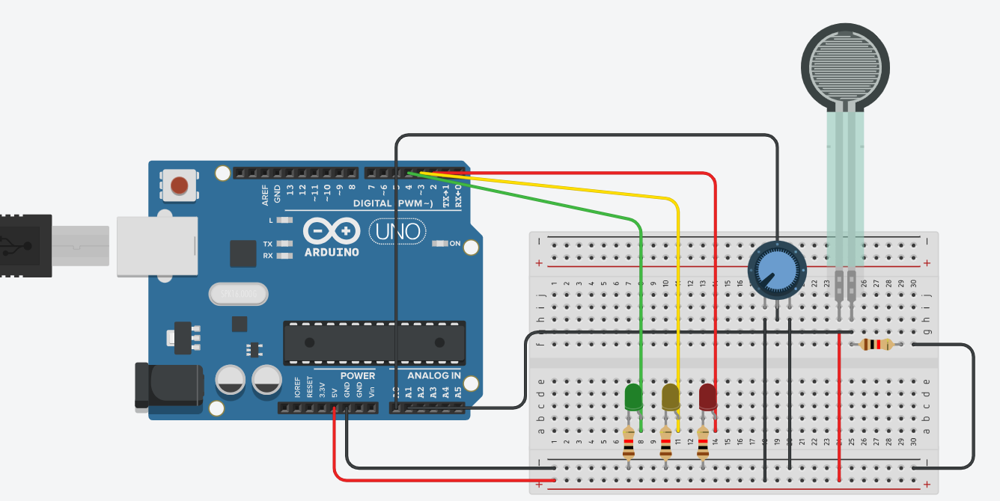

# Nimbos carregando Nuvens de inovação - Bueiros Inteligentes

O sistema Nimbos utiliza o Arduino Uno como unidade de controle embarcada para realizar o monitoramento local de bueiros em áreas urbanas com risco de alagamento.

Autores
- Maria Eduarda Sousa Acyole de Oliveira `566337`
- Matheus Goes da Silva `566407`
- Mayke Santos `562680`

## 📦 Componentes a serem Utilizados
- Arduino Uno 
- Sensor de peso (célula de carga + HX711)
- Sensor de vazão de água
- Módulo GPS (ex: NEO-6M)
- Módulo Wi-Fi (ESP8266 ou similar)
- LEDs (verde, amarelo, vermelho)
- Bateria recarregável (ex: Li-Ion)

## ⚙️ Funcionamento
### 1. Coleta de Dados
- O sensor de peso detecta acúmulo de sujeira no bueiro.
- O sensor de vazão mede a velocidade da água para verificar se há obstruções.
- O GPS registra a localização exata do bueiro.

### 2. Processamento Local
O Arduino processa os dados dos sensores e classifica o risco de alagamento:

Verde: Sem risco.
Amarelo: Atenção.
Vermelho: Risco de alagamento iminente.

### 3. Sinalização
- LEDs indicam localmente o nível de risco detectado.
- Envio de Dados
- Os dados processados são enviados via Wi-Fi para a plataforma online do Nimbos.

## Demonstração em vídeo

## Como Reproduzir

1. Montagem do Circuito:

   
3. Carregando o Código:
- Abra o Arduino IDE.
- Baixe ou copie o código-fonte do projeto.
- Selecione a placa correta (ex: Arduino Uno) e a porta.
- Clique em "Upload" para carregar o código na sua placa.
  
3. Testando o Sistema:

# Limitações da Simulação (Tinkercad)
Este projeto foi desenvolvido utilizando o simulador Tinkercad, que possui limitações quanto à simulação de sensores reais. Por isso, os seguintes componentes foram adaptados:

### 🟠 Sensor de Força (FSR) como Sensor de Peso:
- **Simulado**: Sensor de força.
- **Real**: Célula de carga (load cell) com capacidade acima de 1 kg.
- **Limitação**: No Tinkercad, o sensor de força só permite simular pesos equivalentes a até aproximadamente 1 kg (cerca de 9,8 N).
**Observação**: Na aplicação real, o sistema precisará usar sensores adequados à carga esperada nos bueiros, que pode ultrapassar vários quilos.

### 🟡 Potenciômetro como Sensor de Vazão:
- **Simulado**: Potenciômetro.
- **Real**: Sensor de vazão com medição em L/min ou m³/s.
- **Limitação**: O potenciômetro não mede vazão de fato, apenas simula variação de fluxo girando o eixo manualmente.
**Observação**: Na aplicação final, será necessário integrar um sensor de vazão apropriado (como o YF-S201 ou outro compatível).
